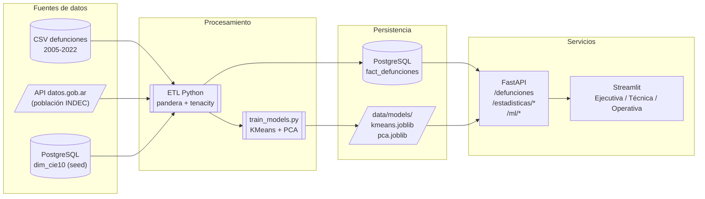

# Arquitectura

## Vista general (C4 nivel 2 — contenedores)

## Componentes

### ETL (`etl/`)

| Módulo | Responsabilidad |
|---|---|
| `extract/load_csv.py` | Lee CSV con tipos seguros |
| `extract/load_api.py` | Consume API de datos.gob.ar (tenacity retries + fallback offline) |
| `extract/load_db.py` | Lee `dim_cie10` de PostgreSQL |
| `transform/cleaning.py` | Filtros, normalizaciones, dropping de nulls |
| `transform/feature_engineering.py` | Capítulos CIE-10 + encodings ML |
| `transform/enrich.py` | Join población → calcula tasa por 100k |
| `load/to_postgres.py` | TRUNCATE + INSERT batch a `fact_defunciones` |
| `schemas.py` | Validación pandera (entrada y salida) |
| `train_models.py` | Entrena KMeans/PCA, persiste joblib + metadata |
| `main.py` | Orquesta con try/except por etapa y logging estructurado |

### API (`api/`)

FastAPI con SQLAlchemy 2.0 (sync). Routers en `api/routers/`:

- `/health`, `/ready` — probes para Railway.
- `/defunciones` — listado paginado con filtros.
- `/estadisticas/*` — agregaciones (serie temporal, top causas, por edad, tasa).
- `/ml/cluster`, `/ml/pca`, `/ml/metadata` — inferencia de modelos persistidos.

Docs OpenAPI en `/docs` (Swagger) y `/redoc` automáticas.

### Dashboard (`dashboards/`)

Streamlit multi-página con `pages/`:

| Página | Audiencia | Foco |
|---|---|---|
| Ejecutiva | C-level / gerencia | KPIs grandes, tendencia, top causas — lenguaje de negocio |
| Técnica | Data Science | Clustering, PCA, métricas — terminología técnica |
| Operativa | Analistas | Filtros granulares, tabla descargable, drill-down |

Todas las páginas consumen la API; no acceden directo a Postgres. Esto
permite cachear con `@st.cache_data` y desplegar el dashboard sin necesidad
de credenciales de BD.

## Decisiones de diseño

| Decisión | Justificación |
|---|---|
| FastAPI sobre Flask | Docs OpenAPI automáticas, validación Pydantic, async-ready |
| SQLAlchemy ORM (sync) | API simple, sin concurrencia masiva; menos boilerplate que async |
| Streamlit sobre Plotly Dash | Velocidad de desarrollo; multi-página nativa |
| Modelos ML persistidos vía joblib | Predicción en runtime O(1), separa entrenamiento de inferencia |
| TRUNCATE + INSERT (no UPSERT) | ETL es batch; idempotente y simple |
| pandera para validación | Falla temprano si CSV cambia de schema |
| Fallback offline en API externa | El ETL no se rompe si datos.gob.ar está caído |
| Multi-stage Docker | Imágenes finales chicas, sin compiler en runtime |
| Cada servicio en su Dockerfile | Railway despliega servicios por separado |

## Flujo de datos punta a punta

1. **Extract**: `etl/main.py:run()` lanza paralelo conceptual los 3 extract.
2. **Transform**: cleaning → feature engineering → enrich con población → validación pandera.
3. **Load**: TRUNCATE + bulk insert (chunks de 5k) a `fact_defunciones`.
4. **Train** (opcional, cuando hay actualización): `etl/train_models.py` regenera los `.joblib`.
5. **Serve**: FastAPI lee de Postgres + carga lazy los modelos (lru_cache).
6. **Consume**: Streamlit hace HTTP a la API y cachea los JSON.
